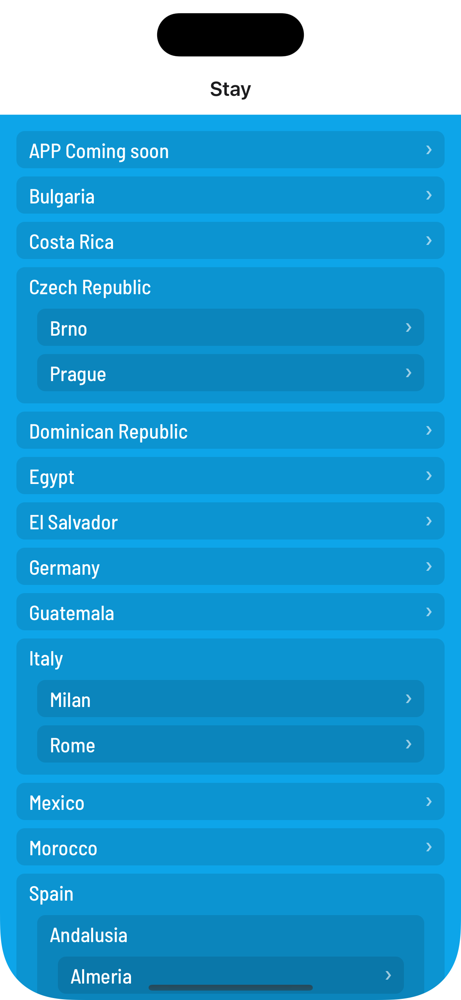
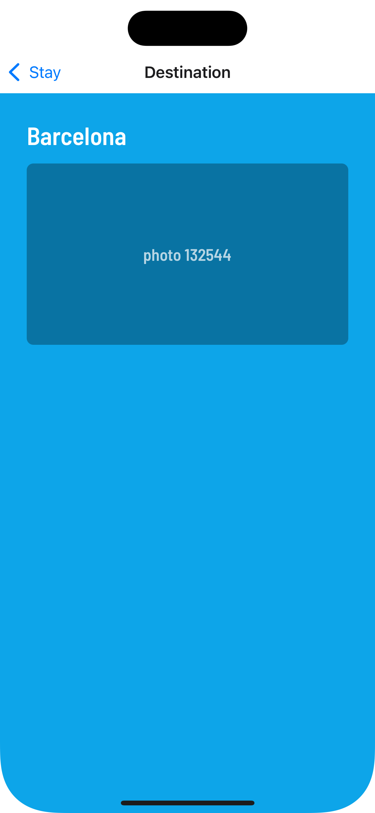

# Stay

## Demo de la aplicación (detalle de listado)



## Demo de la aplicación (detalle de página de destino)



## Consideraciones del desarrollo:

- He elegido _bun_ como gestor de paquetes por su velocidad.
- Utilizo _Expo_ para el desarrollo multiplataforma por encima de ReactNative
  por si facilidad de uso, la comunidad, sus librerías open source.
- Uso _TypeScript_ por su tipado y su capacidad para detectar errores en tiempo
  de desarrollo.
- Uso _NativeWind_ para el diseño de la app por tener un sistema de diseño
  potente y coherente en toda la aplicación, por simplicidad de uso, porque
  reduce el tiempo de implementación de estilos y reduce considerablemente el
  tamaño de la app optimizando el rendimiento. Sobre todo es muy fácil de
  extender y personalizar.
- Uso _React Router_ para la navegación por su potencia, simplicidad y facilidad
  de uso. Permite probar rutas personalizadas.

Datos:

- He creado un _API_ para acceder al endpoint proporcionado para esta demo.
  Escondiendo así el APIkey que debe ser privado y estar en el código fuente de
  la app (uso variables de entorno que no están copiadas en github por razones
  de seguridad).
- Utilizo _tanstack/query_ para la gestión de estados y la caché de datos. Desde
  esta librería gestionamos las peticiones al API y con la caché de datos que
  proporciona evitamos innecesarias peticiones al servidor, mejorando el
  rendimiento de la app y la experiencia de usuario.

## Estructura de carpetas

- _@/app_ -> las rutas de la app (navegación)
- _@/screens_ -> las pantallas de la app
- _@/components_ -> los assets de la app (imágenes, fuentes, etc)
- _@/assets_ -> los assets de la app (imágenes, fuentes, etc)
- _@/utils_ -> las funciones de utilidades globales

### @/app -> rutas

Las rutas deben simplemente llamar a Screens y pasar los props que necesite.
Pueden hacer tener la lógica de navegación y autenticación pero no de diseño,
esa es la parte de Screens.

### @/screens

Las pantallas de la app -> deben funcionar por si mismas, dependiendo de los
parámetros que reciban y llamando a componentes que necesite su diseño.

### @/components

Los componentes a medida para esta app. Piezas reutilizables que pueden
utilizarse en diferentes pantallas y que pueden tener su propia lógica de
interacción y estado.

### @/hooks -> custom hooks

Hooks personalizados (en este caso no he necesitado crear ninguno)

### @/utils -> utilidades generales para toda la APP

Utilidades globales para ser usados dentro de screens, componentes y hooks

---

# Instalación de Stay DEMO

```bash


  # clonar el repositorio e instalar las dependencias con bun
  bun install

  # elegir ExpoGo para no tener que compilarla, abrir la app en el simulador iOS / Android
  bun start

```

## Notas finales

No he incluido test unitarios dado que no suelo utilizarlos en mis proyectos
nativos últimamente.

Entre el tiempo que se tarda en escribirlos, la ayuda que me da typescript,
linter y el tiempo que se tarda en depurar errores, no me compensa.

La configuración de test con las ultimas versiones de react native y expo es muy
engorrosa y no me ha compensado el tiempo para el resultado que obtengo al
final.

Si es algo importante para Stay puedo desarrollarlos en un futuro. Pero
actualmente no le veo el sentido.
